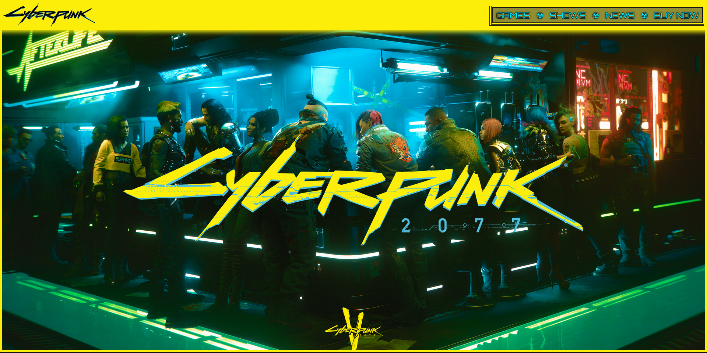

# Cyberpunk 2077 Website Redesign

A fan-made Cyberpunk 2077-inspired website built with HTML, CSS, JavaScript, and JSON.

A single-page redesign project.

## Features

- Responsive Cyberpunk-inspired UI
- Animated looped typing effect
- Dynamic news section using JSON data
- Interactive game/show selection
- Email validation form
- Custom cursor

## Preview

## Credits

Inspired by the official [`Cyberpunk 2077 website`](https://www.cyberpunk.net/us/en/).

© [`CD PROJEKT RED`](https://www.cdprojektred.com/en). Cyberpunk 2077 and all related trademarks, logos, and artwork belong to their respective owners.
This website is a non-commercial fan project created for educational and portfolio purposes. 

---

Created by [`<lexiCodes/>`](https://github.com/nihilistic-lex)